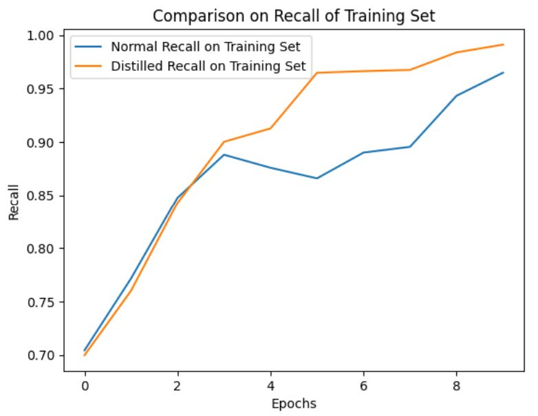
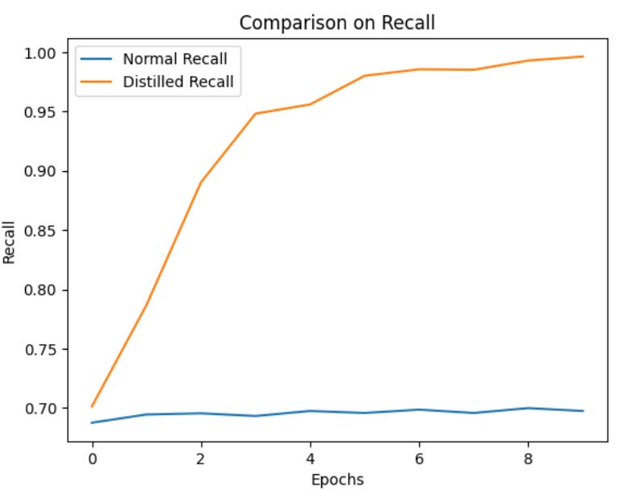
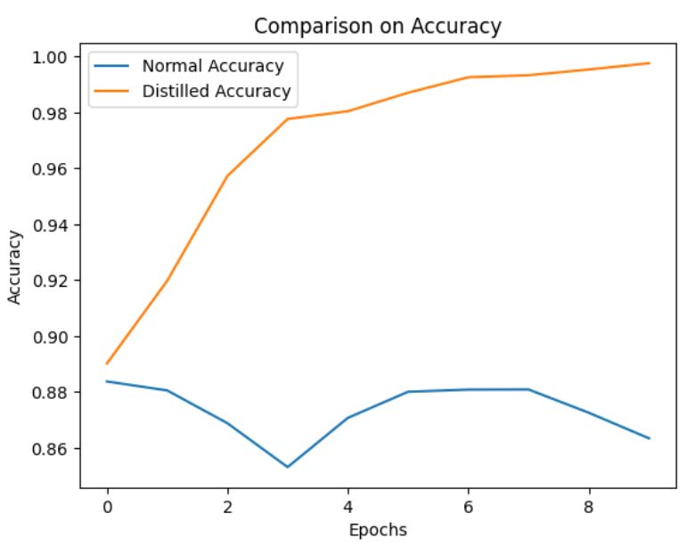

<head>
  <link rel="stylesheet" type="text/css" href="styles.css">
</head>
<a class="top-link hide" href="#top">↑</a>

# Knowledge Distillation targeted at GliNER
by [Zixiang Xu](mailto:zxu635@gatech.edu), [Runmin Ma](mailto:rma308@gatech.edu), [Yiwei Wang](mailto:ywang3607@gatech.edu)

## Catalog
* [Abstract](#abstract)

  1. [Introduction](#introduction)
  2. [Prior Related Work](#priorrelatedwork)
  3. [Pre-trained GliNER Model](#pretrainedglinermodel)
  4. [Data](#data)
  5. [Student Model Design](#studentmodeldesign)
  6. [Experiments and Results](#experimentsandresults)
  7. [Analysis](#analysis)
  8. [Conclusion](#conclusion)
* [References](#references)

## Abstract 
Knowledge Distillation with GliNER explores the usage and effectiveness of knowledge distillation in improving the efficiency of large Natural Language Processing (NLP) models. The GliNER model ([Zaratiana et al., 2023](#ref4)) focuses on Named Entity Recognition tasks that aims to identify any entity type in sentences using a bidirectional transformer encoder similar to BERT model. By leveraging large pre-trained GliNER model, our study compares the performance of smaller Long short-term memory networks (LSTM) trained with distilled knowledge from GliNER against the performance of those trained with raw data. Through comprehensive testing, knowledge distillation shows benefits and confidence in transferring the capabilities of a large and complex NLP model to smaller and more efficient models.

## 1. Introduction
The need and quest for more efficient and accurate models is constant. Knowledge distillation can be a great help where a smaller model learns from a larger and more complex model. In our work, we investigate the effectiveness of knowledge distillation in enhancing the performance of smaller natural language processing models, particularly focusing on named entity recognition tasks on lightweight LSTM model. We compare the performance of smaller models trained directly on raw data against the same models trained with knowledge data distilled from output probability distribution of the larger pre-trained GliNER model.

The pre-trained GliNER model ([Zaratiana et al., 2023](#ref4)) has been trained on extensive data and has demonstrated strong performance in zero-shot evaluations on various Named Entity Recognition (NER) benchmarks. Named Entity Recognition has significant importance in various Natural Language Processing applications. On the other hand, the smaller models are chosen to represent different paradigms in sequence modeling. The two smaller models are compared based on multiple metrics including model accuracy, computational efficiency, and parameter count. By examining their performance, we aim to discern the advantages and limitation of knowledge distillation in the context of natural language processing tasks.

This approach provides insights into knowledge distillation techniques for improving NLP models and balancing between model size and performance. Exploring the impact of knowledge distillation can be helpful for advancement and developing more scalable models. We will evaluate how well knowledge distillation works by comparing the accuracy of models trained with and without distillation and see how they compare against the large model’s performance. This comparison will provide insights into the utility of knowledge distillation in transferring the capabilities of a large, complex model to smaller, more efficient models.

## 2. Prior Related Work
Knowledge distillation is the process of transferring knowledge from a complex, teacher model to a simpler, student model. This process aims to distill the teacher model’s expertise into the student model, enabling it to achieve comparable performance with reduced computational resources ([Hinton et al., 2015](#ref1)).

In recent years, TextBrewer is introduced as an open-source knowledge distillation toolkit designed for natural language processing tasks ([Yang et al., 2020](#ref3)). TextBrewer has shown great results compared to the public distilled BERT models with similar parameters. Similarly, other work using knowledge distillation with zero-shot has shown great results as well. Researchers have developed models where the student model learns from a much larger teacher model without any task specific data ([Rashid et al., 2020](#ref2)) . The model was compressed 30 times through learning output distribution from the teacher model.

We wish to perform similar knowledge distillation task with the teacher model being the pretrained GliNER model and the students model is a LSTM model.

## 3. Pre-trained GliNER Model
GliNER is a generalist model for named entity recognition task using bidirectional transformer([Zaratiana et al., 2023](#ref4)). The model leverages the usage of parallel entity extraction instead of sequential token generation. The pre-trained GliNER model is accessible on Github and HuggingFace.

In [Figure 1](#fig1), GliNER model first tokenizes input entity and a sentence or text. Then the two language models outputs representation for each token and the entity embeddings are fed into a Feed- Forward network. Afterward, the model computes a matching score between the entity representation and span representation using sigmoid activation with dot product. Lastly, the entity embedding with the highest matching score would be catagorized with the span representation.

|                                                                                                   |                                                     |
|:------------------------------------------------------------------------------------------------------------------------------|:--------------------------------------------------------------------------------|
| **Figure 1**: Model architecture of the GliNER model with a BiLM architecture used by [Zaratiana et al. (2023, p. 4)](#ref4). | **Figure 2**: Model architecture of our student model based on the GliNER model |

## 4. Data
Our dataset can be processed through https://huggingface.co/datasets/urchade/pilemistral-v0.1/tree/main. In this dataset, each sentence has been pre-divided into multiple tokens, and the category of each token from a certain position to another is given in the form of a dictionary. The dictionary contains all the positive examples. Tokens not present in the dictionary do not belong to any category.

## 5. Student Model Design
Since GliNER is designed to dynamically input labels for model inference, we adopted the same twin-tower architecture as the GliNER model. The selectable labels and the sentences are passed through an embedding layer separately, then the sentence is processed through an LSTM network to obtain the feature vector for each token. Since the labels do not carry temporal information, after being encoded through the embedding layer, they are directly mapped to the same dimension as the feature vectors via a fully connected layer. Afterwards, a dot product operation is performed between the two, similar to an attention structure, to calculate the similarity between each label and each token.

For each token, a softmax operation is performed on the similarities of all its labels, ultimately obtaining its probability distribution.

## 6. Experiments and Results

We designed the following experiment: we used the first 1,000 sentences of the dataset as the training set and the last 100 sentences as the test set.

We focus on comparing student models that do not use knowledge distillation, i.e., those that use hard labels as the training target, with those that use knowledge distillation, i.e., a combination of soft and hard labels as the training target. We first observe their loss and recall on the training set. First, we observe their loss and recall on the training set.

|                                                 |                                                                   |                                                               |                                                     |
|:----------------------------------------------------------------------------|:----------------------------------------------------------------------------------------------|:------------------------------------------------------------------------------------------|:--------------------------------------------------------------------------------|
| **Figure 3**: Loss of student model with and without knowledge distillation | **Figure 4**: Recall of student model on training set with and without knowledge distillation | **Figure 5**: Recall of student model on test set with and without knowledge distillation | **Figure 6**: Accuracy of student model with and without knowledge distillation |

From [figure 3](#fig3) and [4](#fig4), We emphasize the comparison of recall because there are a large number of negative examples in the training set, and we are more concerned about whether the model can accurately identify all positive examples. We can see that on the training set, both models demonstrated excellent convergence speed, and ultimately both achieved a relatively high recall.

However, from [figure 5](#fig5) and [6](#fig6), we observed completely different results on the test set. The model trained with soft labels through knowledge distillation showed similar recall and f1 score as on the training set. However, the model trained with hard labels did not improve in performance, neither in accuracy nor recall, even after multiple epochs of training, when exposed to completely unseen corpora in the training set.

| **Model Name** | **Accuracy** | **Recall** | **Parameter** |
|:--------------:|:------------:|:----------:|:-------------:|
|     GliNER     |     100%     |    100%    |     2.1B      |
| Student Model  |     86%      |    69%     |      6M       |
|  Distilled SM  |     99%      |    97%     |      6M       |

**Table 1**: Comparison of Model Performances

Last, we compare the student model with the original GliNER model. We can see from the [table
1](#table1) that the distilled student model does not lose
much performance on this test set, while the directed
trained student model performs much worse.

## 7. Analysis
The observed phenomenon can be attributed to several key aspects:
1. ***Generalization Capability***: Models trained with knowledge distillation generally exhibit better generalization capabilities. During the knowledge distillation process, the student model learns not only the exact classification of hard labels but also captures the nuances of the output probability distribution through soft labels learned from the teacher model. This learning of probability distributions helps the student model better understand the relationships and features between classes, thereby improving its ability to generalize when encountering unseen test data.
2. ***Overfitting Issue***: Models not utilizing knowledge distillation may overfit the training set. This means they perform well on the training data but fail to maintain this performance on new, unseen data. Overfitting occurs due to the model complexity being higher than necessary to explain the data or due to overly long training periods, among other reasons.
3. ***Robustness to Label Errors***: Knowledge distillation, by mimicking the output of the teacher model, might make the student model more robust to noise or incorrect labels in the training data. The teacher model is typically a larger, more complex network that has been optimized and validated across multiple datasets, and its outputs are generally more reliable than single hard labels.

## 8. Conclusion

In this study, we have demonstrated the effectiveness of knowledge distillation applied within the domain of natural language processing, specifically using an LSTM-based model to distill knowledge from the original GliNER model. Our investigation reveals that employing knowledge distillation, even when maintaining the same model architecture, significantly enhances the accuracy on the test set compared to using hard labels alone.

Furthermore, this study highlights the potential of knowledge distillation as a valuable technique for model compression and efficiency. By distilling a complex model like GliNER into a simpler LSTM architecture without significant loss in performance, we demonstrate the feasibility of deploying more efficient models in resource-constrained environments while maintaining high accuracy.

## References
Geoffrey Hinton, Oriol Vinyals, and Jeff Dean. 2015. [Distilling the knowledge in a neural network](http://arxiv.org/abs/1503.02531).

Ahmad Rashid, Vasileios Lioutas, Abbas Ghaddar, and Mehdi Rezagholizadeh. 2020. [Towards zero-shot knowledge distillation for natural language processing](http://arxiv.org/abs/2012.15495).

Ziqing Yang, Yiming Cui, Zhipeng Chen, Wanxiang Che, Ting Liu, Shijin Wang, and Guoping Hu. 2020. [Textbrewer: An open-source knowledge distillation toolkit for natural language processing](https://doi.org/10.18653/v1/2020.acl-demos.2). In *Proceedings of the 58th Annual Meeting of the Association for Computational Linguistics: System Demonstrations*. Association for Computational Linguistics.

Urchade Zaratiana, Nadi Tomeh, Pierre Holat, and Thierry Charnois. 2023. [Gliner: Generalist model for named entity recognition using bidirectional transformer](http://arxiv.org/abs/2311.08526).
